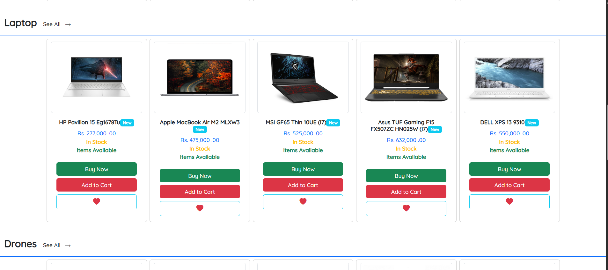
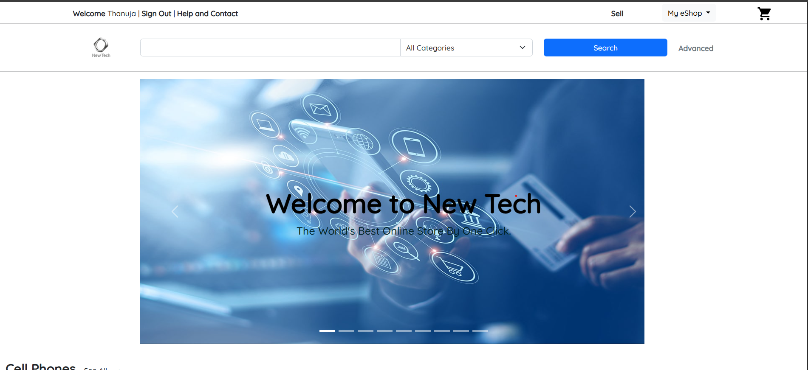

# 🛍️ New Tech Electronics Platform

A responsive front-end design for **New Tech**, a company that buys and sells quality electronic items — similar to eBay. This platform allows sellers to register and manage products, and customers to browse, search, purchase, and track their electronics with ease.

---

## 🚀 Features

- 🔐 **Customer Authentication**  
  Register and log in to your personal account.

- 🏠 **Home Page**  
  Browse featured products with an intuitive interface.

- 📦 **Product Listing & Details**  
  View all products and explore single product details.

- 🛒 **Cart & Watchlist**  
  Add products to cart or save for later in your watchlist.

- 🧾 **Purchase History & Invoice**  
  Track past purchases and view invoice summaries.

- 🔍 **Advanced Search**  
  Find products using keywords, filters, and search logic.

- ⚙️ **Admin Login & Panel**  
  Secure login and dedicated dashboard for managing the platform.

- 🛠️ **Manage Products & Users**  
  Admin can add, update, and remove items or users.

- 📱 **Fully Responsive Design**  
  Works smoothly on mobile, tablet, and desktop devices.

---

## 🛠️ Technologies Used

- 🧱 **HTML5**
- 🎨 **CSS3**
- 🐘 **PHP**
- 💡 **JavaScript**
- 🌐 **Bootstrap Framework**

---

## 📁 Folder Structure
```
newtech-electronics/
├── 📄 index.php
├── 📄 README.md
├── 📄 LICENSE
├── 📄 .gitignore
├── 📁 assets/
│   ├── 📁 css/
│   │   └── style.css
│   ├── 📁 js/
│   │   └── script.js
│   ├── 📁 images/
│   │   └── logo.png
│   └── 📁 fonts/
│       └── (custom fonts if any)
├── 📁 includes/
│   ├── header.php
│   ├── footer.php
│   └── db_connection.php
├── 📁 pages/
│   ├── login.php
│   ├── register.php
│   ├── home.php
│   ├── product_list.php
│   ├── product_view.php
│   ├── cart.php
│   ├── watchlist.php
│   ├── invoice_history.php
│   └── admin/
│       ├── admin_login.php
│       ├── dashboard.php
│       ├── manage_products.php
│       └── manage_users.php
├── 📁 uploads/
│   └── (user product images, etc.)
├── 📁 screenshots/
│   └── screenshot.png
└── 📁 config/
    └── config.php


```
---

## 🖼️ Screenshot





---

## 💡 Note

This is a **front-end only** design. No database or back-end logic is included.

---

## ✍️ Author

Developed by **[Junox Nujan](https://github.com/thejunox)**  
🎓 Student @ University of Colombo | BICT(Hons)  
🎮 Hobbyist Gamer + Anime Fan  
🌐 Passionate about Web Development & Open Source

---

## 📜 License

This project is released under the [MIT License](LICENSE).
